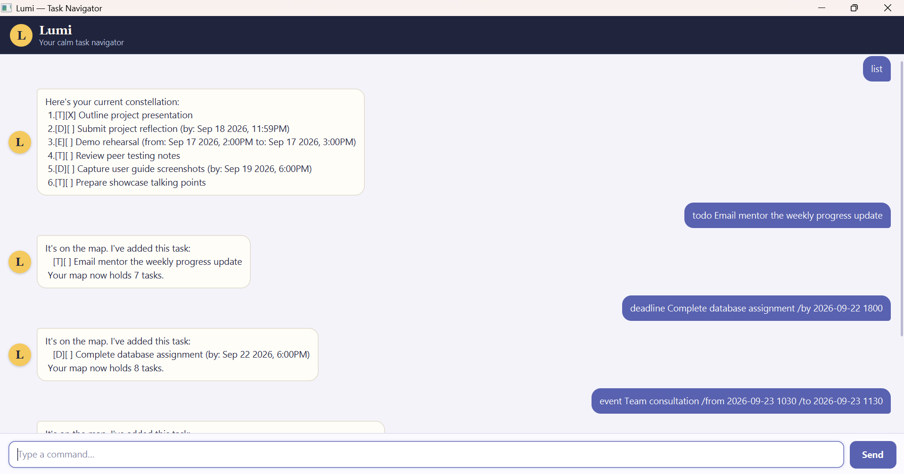

# Lumi User Guide

Lumi is a desktop task manager for users who prefer entering short commands instead of navigating through many
menus. It keeps to-dos, deadlines, and events in one list, and automatically saves every change. Lumi's calm,
celestial personality helps you chart one clear step at a time.



## Table of contents

- [Quick start](#quick-start)
- [Understanding Lumi](#understanding-lumi)
- [Command format](#command-format)
- [Features](#features)
  - [Adding a to-do: `todo`](#adding-a-to-do-todo)
  - [Adding a deadline: `deadline`](#adding-a-deadline-deadline)
  - [Adding an event: `event`](#adding-an-event-event)
  - [Listing tasks: `list`](#listing-tasks-list)
  - [Finding tasks: `find`](#finding-tasks-find)
  - [Marking a task as complete: `mark`](#marking-a-task-as-complete-mark)
  - [Marking a task as incomplete: `unmark`](#marking-a-task-as-incomplete-unmark)
  - [Deleting a task: `delete`](#deleting-a-task-delete)
  - [Rescheduling a task: `snooze`](#rescheduling-a-task-snooze)
  - [Ending the session: `bye`](#ending-the-session-bye)
- [Saving data](#saving-data)
- [FAQ](#faq)
- [Known limitations](#known-limitations)
- [Command summary](#command-summary)

## Quick start

1. Ensure that Java 25 is installed.

   ```text
   java -version
   ```

   The output should report Java version 25.

1. Obtain `lumi.jar`. If you are building Lumi from source, follow the
   [build instructions](../README.md#building-the-fat-jar).

1. Place `lumi.jar` in the folder where you want Lumi to keep its data.

1. Open a terminal in that folder and run:

   ```text
   java -jar lumi.jar
   ```

1. Enter a command in the text field at the bottom of the window. Press **Enter** or select **Send** to execute it.

1. Try these commands:

   ```text
   todo Review peer testing notes
   deadline Submit project reflection /by 2026-09-18 2359
   event Demo rehearsal /from 2026-09-17 1400 /to 2026-09-17 1500
   list
   ```

## Understanding Lumi

Lumi uses a short code to show each task's type and completion status.

| Symbol | Meaning |
| --- | --- |
| `[T]` | To-do without a date or time. |
| `[D]` | Deadline with a due date or time. |
| `[E]` | Event with a start and end. |
| `[ ]` | Task is incomplete. |
| `[X]` | Task is complete. |

For example:

```text
[D][ ] Submit project reflection (by: Sep 18 2026, 11:59PM)
```

This is an incomplete deadline.

### Task numbers

Commands such as `mark`, `unmark`, `delete`, and `snooze` identify tasks using the number shown by `list`.

> **Important:** Run `list` before using a task-number command. The numbering shown by `find` belongs only to the
> search results and should not be used as the task's number.

Task numbers may change after a task is deleted. Run `list` again after deleting a task.

## Command format

The following notation is used throughout this guide:

- Words in `UPPER_CASE` are values supplied by you.
- Items in square brackets are optional.
- Type command words and separators exactly as shown. They are case-sensitive.
- Enter one complete command at a time.

For example, the format:

```text
deadline DESCRIPTION /by DATE [TIME]
```

can be used as:

```text
deadline Submit project reflection /by 2026-09-18 2359
```

### Dates and times

Lumi accepts either of these date formats:

- `YYYY-MM-DD`, such as `2026-09-18`.
- `D/M/YYYY`, such as `18/9/2026`.

You may follow a date with an optional four-digit, 24-hour time in `HHmm` format:

- `0905` means 9:05 AM.
- `1400` means 2:00 PM.
- `2359` means 11:59 PM.

The date and time must be valid. Natural-language dates such as `tomorrow` are not supported.

> **Note:** `/by`, `/from`, and `/to` are reserved separators. Include a space before and after each separator.

## Features

### Adding a to-do: `todo`

Adds a task without a date or time.

Format:

```text
todo DESCRIPTION
```

Example:

```text
todo Review peer testing notes
```

Lumi adds the task as incomplete and assigns it the `[T]` type.

### Adding a deadline: `deadline`

Adds a task that must be completed by a specific date, with an optional time.

Format:

```text
deadline DESCRIPTION /by DATE [TIME]
```

Examples:

```text
deadline Register for the career fair /by 2026-09-25
deadline Submit project reflection /by 18/9/2026 2359
```

Lumi assigns the task the `[D]` type. If no time is supplied, Lumi displays only the date.

### Adding an event: `event`

Adds a task that occurs between a start and an end.

Format:

```text
event DESCRIPTION /from DATE [TIME] /to DATE [TIME]
```

Example:

```text
event Team consultation /from 2026-09-23 1030 /to 2026-09-23 1130
```

Lumi assigns the task the `[E]` type and displays both ends of the event.

> **Tip:** Use an end date and time later than the start so that the event duration is meaningful when snoozed.

### Listing tasks: `list`

Displays every stored task in its current order and shows the number used by task-number commands.

Format:

```text
list
```

Example output:

```text
Here's your current constellation:
1.[T][X] Outline project presentation
2.[D][ ] Submit project reflection (by: Sep 18 2026, 11:59PM)
3.[E][ ] Demo rehearsal (from: Sep 17 2026, 2:00PM to: Sep 17 2026, 3:00PM)
```

`list` must not be followed by extra text.

### Finding tasks: `find`

Displays tasks whose descriptions contain the given keyword or phrase. Matching is case-insensitive.

Format:

```text
find KEYWORD
```

Examples:

```text
find project
find TEAM CONSULTATION
```

`find project` matches descriptions such as `Outline project presentation` and `Submit project reflection`.
Dates, task types, and completion statuses are not searched.

> **Note:** A multi-word search is treated as one phrase. For example, `find project presentation` finds descriptions
> containing that complete phrase.

### Marking a task as complete: `mark`

Marks a task as complete. Its status changes from `[ ]` to `[X]`.

Format:

```text
mark TASK_NUMBER
```

Example:

```text
mark 2
```

The task number must be a positive whole number currently shown by `list`.

### Marking a task as incomplete: `unmark`

Returns a completed task to the incomplete state. Its status changes from `[X]` to `[ ]`.

Format:

```text
unmark TASK_NUMBER
```

Example:

```text
unmark 2
```

### Deleting a task: `delete`

Permanently removes a task from the list.

Format:

```text
delete TASK_NUMBER
```

Example:

```text
delete 3
```

Lumi confirms the removed task and reports the number of remaining tasks. Later tasks are renumbered.

> **Caution:** Deletion cannot be undone from within Lumi. Run `list` first and check the task number carefully.

### Rescheduling a task: `snooze`

Moves a deadline or event to a new date or time.

Format:

```text
snooze TASK_NUMBER /to DATE [TIME]
```

Examples:

```text
snooze 2 /to 2026-09-24 2000
snooze 3 /to 24/9/2026 1430
```

For a deadline, the supplied date and time become its new due date and time.

For an event, the supplied date and time become its new start. Lumi moves the end by the same amount, preserving the
event's original duration. The task's completion status is also preserved.

To-dos cannot be snoozed because they do not have a schedule.

### Ending the session: `bye`

Ends the current Lumi session.

Format:

```text
bye
```

In the graphical interface, Lumi disables the command field and **Send** button. Close the window when you are done.
`bye` must not be followed by extra text.

## Saving data

Lumi automatically saves the full task list after a successful `todo`, `deadline`, `event`, `mark`, `unmark`,
`delete`, or `snooze` command. No manual save command is needed.

The data is stored at:

```text
data/lumi.txt
```

This path is relative to the folder from which Lumi was started. Start Lumi from the same folder each time to use the
same task list.

> **Caution:** Edit `data/lumi.txt` manually only if you understand Lumi's storage format. An unreadable line is
> skipped when Lumi starts. Back up the file before editing it.

## FAQ

### How do I move my tasks to another computer?

1. Close Lumi on the original computer.
1. Copy `data/lumi.txt` to the `data` folder beside Lumi on the new computer.
1. Start Lumi on the new computer and run `list` to confirm that the tasks loaded.

### Why does Lumi say `Signal unclear`?

Lumi uses this message for invalid or incomplete commands. Read the explanation that follows it, correct the command,
and try again. A rejected command does not change the task list.

### Why did my task numbers change?

Deleting a task closes the gap in the list, so later tasks receive smaller numbers. Run `list` again before entering
another task-number command.

### Why is a valid-looking date rejected?

Check that the date exists and follows `YYYY-MM-DD` or `D/M/YYYY`. If a time is included, use exactly four digits in
24-hour `HHmm` format. For example, use `0900`, not `9:00` or `900`.

### Why are my tasks missing after moving `lumi.jar`?

Lumi reads `data/lumi.txt` relative to the folder from which it is started. Return to the original folder, or copy its
`data` folder to the new location.

## Known limitations

- Lumi supports exact command syntax rather than natural-language commands.
- `find` searches descriptions only and does not search dates, types, or completion statuses.
- Lumi does not currently provide undo, recurring tasks, reminders, or in-app help.
- Task numbers used by `mark`, `unmark`, `delete`, and `snooze` must come from `list`, not from `find` results.

## Command summary

| Action | Format | Example |
| --- | --- | --- |
| Add a to-do | `todo DESCRIPTION` | `todo Review peer testing notes` |
| Add a deadline | `deadline DESCRIPTION /by DATE [TIME]` | `deadline Submit report /by 2026-09-18 2359` |
| Add an event | `event DESCRIPTION /from DATE [TIME] /to DATE [TIME]` | `event Demo /from 2026-09-17 1400 /to 2026-09-17 1500` |
| List tasks | `list` | `list` |
| Find tasks | `find KEYWORD` | `find project` |
| Mark complete | `mark TASK_NUMBER` | `mark 2` |
| Mark incomplete | `unmark TASK_NUMBER` | `unmark 2` |
| Delete a task | `delete TASK_NUMBER` | `delete 3` |
| Reschedule | `snooze TASK_NUMBER /to DATE [TIME]` | `snooze 2 /to 2026-09-24 2000` |
| End the session | `bye` | `bye` |
